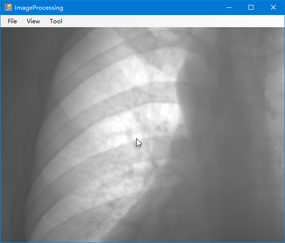
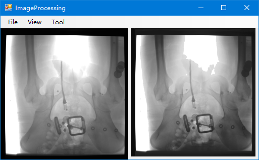
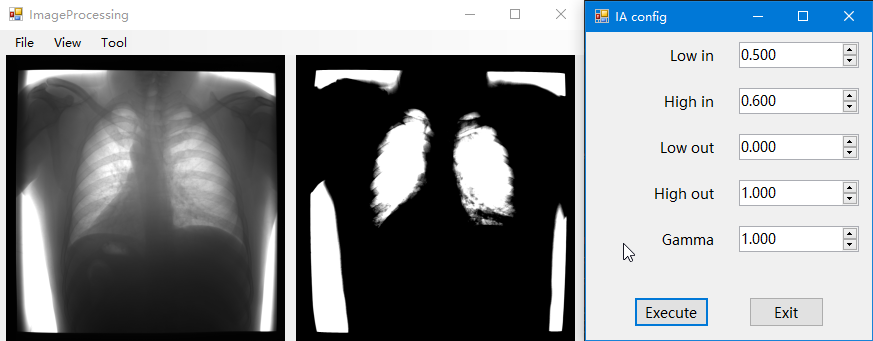
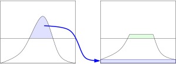
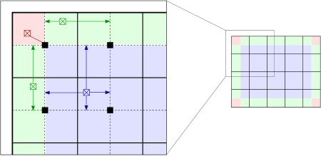

# 数字图像处理实验

实验开发了一个基于WinForm处理并显示医学透视图象的软件。软件支持dr文件格式文件，并支持导出成常见图像格式。软件主要功能有显示直方图，直方图均衡、CLAHE和灰度窗处理方法。软件支持图片平移和缩放，原图像和结果图像支持对比显示和单个显示，原图像居左而结果图像居右。软件如下图所示。

## 软件功能

这一节详细地介绍了软件的功能，并介绍了图像调整参数的调整方法。

### 图像文件打开和保存
 
菜单栏上点击File（文件），出现Open（打开）和Save（保存）选单进行文件的打开和保存。打开图像时结果图像与打开图像一致。保存功能只保存结果图像。

### 图像显示设置

菜单栏上点击View（视图），其中的Fix window（适应窗口）使得结果图片填充整个结果窗口。Only show origin（仅显示原图片）将会把结果图片隐藏，整个窗口显示原图片。Only show result（仅显示结果图片）将会把原图片隐藏，整个窗口显示结果图片。Show both（显示两者）将原图片和结果图片分局左右显示。用户能够自由缩放和移动结果图片。效果如下图所示。

### 直方图显示

菜单栏上点击View，其中的Histogram（显示直方图）将显示原图片和结果图片的直方图，并且支持在后台显示，效果如下图所示。

### 直方图均衡

菜单栏上点击Tool（工具），其中的Histogram Equalization（直方图均衡）可以将原图像全局进行直方图均衡并显示到结果图像上，效果如下图所示。

### 对比度受限的自适应直方图均衡化（CLAHE）

菜单栏上点击Tool，其中的CLAHE可以将原图像全局进行对比度受限的自适应直方图均衡并显示到结果图像上。该操作有两个参数可以调整，其中Split count（分割个数）将整个图像横纵分割为若干大小进行自适应直方图均衡，该参数越大局域对比度越高，过大可能会造成图像失真以及信息丢失；Contrast limit（对比度限制）将限制图像对比度从而减少噪声，该限制值为原图平均对比度的倍数，最值小为1且可为小数，值越大对比度越高。默认值Split count为8，Contrast limit为40，建议Split count调整为2的倍数。参数选好之后可以选择Execute（执行）来预览效果，Exit（退出）可以回到主界面。效果如下图所示。

### 灰度窗方法

菜单栏上点击Tool，其中的Image Adjust（灰度窗方法）可以将原图像数据上生成新的图像，并显示到结果图像和原图像，因此该操作独立于直方图均衡和CLAHE操作，用户可以在选择窗位和窗宽之后来进行直方图均衡和CLAHE操作。该操作有五个参数可以调整，其中Low in（输入最小阈值）指定了图像数据中输入的最小灰度值，该值在0到1之间取百分值，代表从黑色到白色的范围，灰度低于该值的都将归为黑色；High in（输入最大阈值）指定了图像数据中输入的最大灰度值，该值在0到1之间取百分值，代表黑色到白色的范围，灰度高于该值的都将归为白色。所以Low in与High in指定了输入图像数据中灰度的范围，其中Low in就是对应的窗位，High in与Low in的差即是窗宽，值为总窗宽的百分值。其余为额外的调整内容，其中High out（映射最大值）与Low out（映射最小值）指定了输入映射到的灰度范围，Low out指定了输出灰度的最低值，High out指定了输出灰度的最高值，特别的，如果Lou out大于High out，图像将反色。Gamma（伽马值）指定了输入到输出的伽马变换，Gamma值越大，阴影被压缩，Gamma值越小，高光被压缩。注意，与Low out和High out不同，Low in的值必须小于High in的值。参数选好之后可以选择Execute（执行）来预览效果，Exit（退出）可以回到主界面。效果如下图所示。

## 软件算法

这一节详细地介绍了软件的算法及其应用。

### 直方图均衡

> 这种方法通常用来增加许多图像的全局对比度，尤其是当图像的有用数据的对比度相当接近的时候。通过这种方法，亮度可以更好地在直方图上分布。这样就可以用于增强局部的对比度而不影响整体的对比度，直方图均衡化通过有效地扩展常用的亮度来实现这种功能。\
> 这种方法对于背景和前景都太亮或者太暗的图像非常有用，这种方法尤其是可以带来X光图像中更好的骨骼结构显示以及曝光过度或者曝光不足照片中更好的细节。这种方法的一个主要优势是它是一个相当直观的技术并且是可逆操作，如果已知均衡化函数，那么就可以恢复原始的直方图，并且计算量也不大。这种方法的一个缺点是它对处理的数据不加选择，它可能会增加背景噪声的对比度并且降低有用信号的对比度。*来源于维基百科*

均衡化将原始图像的灰度分布映射到顶一个分布上，使得整个灰度均匀的分布在整个灰度空间中。为了达到这个效果，我们将计算原始的灰度分布的累计分布函数H'(i)，均衡化结果为equalized(x,y) = H'(src(x,y))。

### 对比度受限的自适应直方图均衡化（CLAHE）

相对于直方图均衡化，该方法用过利用从领域导出的变换函数来变换每一个像素，变换函数与邻域中的像素值的累积分布函数成比例。邻域的大小是一个参数，它测量了限定尺度内的对比度。对比度限制用来防止噪声被过分的放大。

>*来源于维基百科*

为了高效的计算，我们采用插值的方法。首先将整个图像分割成若干小块，然后对每个小块计算其累积分布函数。在计算累计分布函数之前我们先要限制累计分布函数的斜率，在给定的斜率下，概率密度函数有一个最大值对应我们的限制条件，简单的方法是将超过该值的部分裁剪掉，然后在直方图区间中均等地重新分配。重新分配将再次推动一部分超过我们的限制条件，我们可以迭代地重新分配到超过量忽略不计为止。

>*来源于维基百科*

差值部分如下图所示，图像被分割成若干方块，每个方块都有其对应的累积分布函数，而且经过了对比度限制。在红色区域中的像素不做差值变换，在绿色区域中的像素做线性内插，在蓝色区域中的像素做双线性内插，内插系数反应了像素与每个方块中心像素的位置，使得每个方块的灰度过度是连续的。

>*来源于维基百科*

### 灰度窗方法

灰度窗方法将灰度图像中的灰度值从一个区间转变为另一个区间。本软件处理的图像和一般的计算机图像不同，一个像素所占空间不一定是8位的，因此需要将图像的灰度开窗映射到计算机能够显示的范围中去。该变换为伽马变换，当伽马值为1时为线性变换。
