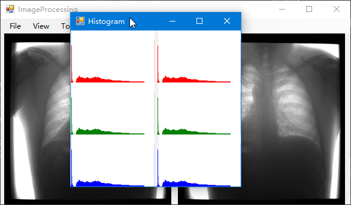

# 数字图像处理实验

实验开发了一个基于WinForm处理并显示医学透视图象的软件。软件支持dr文件格式文件，并支持导出成常见图像格式。软件主要功能有显示直方图，直方图均衡、CLAHE和灰度窗处理方法。软件支持图片平移和缩放，原图像和结果图像支持对比显示和单个显示，原图像居左而结果图像居右。软件如下图所示。

## 软件功能

### 图像文件打开和保存
 
菜单栏上点击File（文件），出现Open（打开）和Save（保存）选单进行文件的打开和保存。打开图像时结果图像与打开图像一致。保存功能只保存结果图像。

### 图像显示设置

菜单栏上点击View（视图），其中的Fix window（适应窗口）使得结果图片填充整个结果窗口。Only show origin（仅显示原图片）将会把结果图片隐藏，整个窗口显示原图片。Only show result（仅显示结果图片）将会把原图片隐藏，整个窗口显示结果图片。Show both（显示两者）将原图片和结果图片分局左右显示。用户能够自由缩放和移动结果图片。效果如下图所示。

### 直方图显示

菜单栏上点击View，其中的Histogram（显示直方图）将显示原图片和结果图片的直方图，并且支持在后台显示，效果如下图所示。

### 直方图均衡

菜单栏上点击Tool（工具），其中的Histogram Equalization（直方图均衡）可以将原图像全局进行直方图均衡并显示到结果图像上，效果如下图所示。

### 对比度受限的自适应直方图均衡化（CLAHE）

菜单栏上点击Tool，其中的CLAHE可以将原图像全局进行对比度受限的自适应直方图均衡并显示到结果图像上。该操作有两个参数可以调整，其中Split count（分割个数）将整个图像横纵分割为若干大小进行自适应直方图均衡，该参数越大局域对比度越高，过大可能会造成图像失真以及信息丢失；Contrast limit（对比度限制）将限制图像对比度从而减少噪声，该限制值为原图平均对比度的倍数，最值小为1且可为小数，值越大对比度越高。默认值Split count为8，Contrast limit为40，建议Split count调整为2的倍数。参数选好之后可以选择Execute（执行）来预览效果，Exit（退出）可以回到主界面。效果如下图所示。

### 灰度窗方法

## 软件算法

### 直方图均衡

### 对比度受限的自适应直方图均衡化（CLAHE）

### 灰度窗方法

